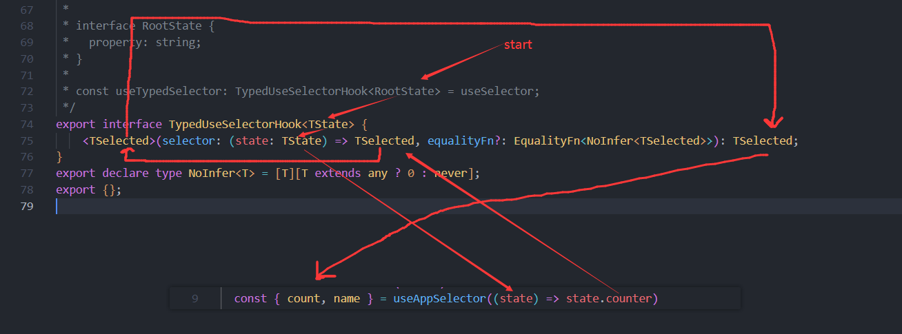

## 网易云音乐笔记

### 0. 技术栈

- React 18
- TS
- webpack
- Redux RTK
- antd

### 1. 创建项目

```bash
create-react-app netease_cloud_music --template typescript
```

### 2. 项目初始化

1. 配置图标

2. 配置网页 `title`

3. **配置目录别名**

   1. 安装 craco: `create-react-app config`

   ```bash
   npm i @craco/craco@alpha -D
   ```

   2. 创建配置文件`craco.config.js`

   ```js
   const path = require('path')

   const resolve = (dir) => path.resolve(__dirname, dir)

   module.exports = {
     webpack: {
       alias: {
         '@': resolve('src')
       }
     }
   }
   ```

   > 能找到，但是**没提示**，并且 ts 会报错（因为 ts 不知道`@`是哪个路径，所以还需要再 ts 配置中`@`对应的路径）

   3. 修改`tscoonfig.json`

   ```json
   "baseUrl": ".",
     "paths": {
       "@/*": [
         "src/*"
       ]
     }
   ```

   

   > 先指明`baseUrl`，然后**配置路径别名**

   4. 修改启动方式为 `craco` `package.json`

   

4. 项目集成`prettier + eslint`

   1. 创建`.editorconfig`

      ```bash
      # http://editorconfig.org

      root = true

      [*] # 表示所有文件适用
      charset = utf-8 # 设置文件字符集
      indent_style = space # 缩进风格(tab | space)
      indent_size = 2 # 缩进大小
      end_of_line = lf # 控制换行类型(lf | cr | crlf)
      trim_trailing_whitespace = true # 去除行尾的任意空白符
      insert_final_newline = true # 始终在文件末尾插入一个新行

      [*.md] # 表示仅对 md 文件使用一下规则
      max_line_length = off
      trim_trailing_whitespace = false
      ```

   2. 配置`prettier`

      1. 安装

      ```bash
      npm i prettier  -D
      ```

      2. 创建`.prettierrc`

      ```bash
      {
        "useTabs": false,
        "tabWidth": 2,
        "printWidth": 80,
        "singleQuote": true,
        "trailingComma": "none",
        "semi": false
      }
      ```

      2. 创建`.prettierignore`

      ```bash
      /build/*
      .local
      .output.js
      /node_modules/**

      **/*.svg
      **/*.sh

      /public/*
      ```

      3. 添加所有文件格式化指令

      ```json
      "prettier": "prettier --write ."
      ```

      

      > 用于整体格式化所有代码

      ```bash
      npm run prettier
      ```

   3. 集成`eslint`

      1. 安装

      ```bash
      npx eslint --init
      ```

      

      

      会自动生成`.eslintrc.js`

      ```js
      module.exports = {
        env: {
          browser: true,
          es2021: true,
          node: true
        },
        extends: [
          'eslint:recommended',
          'plugin:react/recommended',
          'plugin:@typescript-eslint/recommended',
          'plugin:prettier/recommended'
        ],
        overrides: [],
        parser: '@typescript-eslint/parser',
        parserOptions: {
          ecmaVersion: 'latest',
          sourceType: 'module'
        },
        plugins: ['react', '@typescript-eslint'],
        rules: {
          '@typescript-eslint/no-var-requires': 'off'
        }
      }
      ```

      ```
      // commonjs规范
      // 避免 module.exports报错
      env: {
        node: true
      },


      // 避免 requires 报错
      rules: {
      	'@typescript-eslint/no-var-requires': 'off'
      }
      ```
    
      2. `eslint` 结合 `prettier`
    
      > 是`eslint`检查时 按照`prettier`规范
    
      ```
      npm i eslint-plugin-prettier eslint-config-prettier -D
      ```
    
      ```js
      // eslint 结合 prettier
      extends: [
        'plugin:prettier/recommended'
      ],
      ```
    
      > prittier**书写**代码时检查规范
      >
      > eslint **编译**代码时检查规范

### 3. 项目结构搭建


### 4. css 样式重置

1. 安装

```bash
npm i normalize.css
```

2. 通过`craco`配置`less`

```bash
npm i craco-less@2.1.0-alpha.0
```

`craco.config.js`添加配置

```js
const CracoLessPlugin = require('craco-less')
module.exports = {
  plugins: [{ plugin: CracoLessPlugin }]
}
```

> 只有配置了`less` `react`项目才能识别`.less`文件

3. 创建**重置**、**初始化**css 样式、**样式导出**文件


4. index.tsx 中引入

```tsx
import React from 'react'
import ReactDOM from 'react-dom/client'
import App from '@/App'
import 'normalize.css'
import './assets/css/index.less'

const root = ReactDOM.createRoot(document.getElementById('root') as HTMLElement)
root.render(
  <React.StrictMode>
    <App />
  </React.StrictMode>
)
```

### 5. 路由配置

1. 安装 react-router

```bash
npm i react-router-dom
```

2. 创建路由文件`router/index.tsx`

```tsx
import React from 'react'
import { RouteObject } from 'react-router-dom'
import Home from '@/views/home'

const routes: RouteObject[] = [
  {
    path: '/',
    element: <Home />
  }
]

export default routes
```

> - tsx 文件 因为需要识别组件，所以也需要导入 react
> - routes 数组需要类型，这样也能有属性名提示

3. 使用路由表

`App.tsx`

```tsx
import React from 'react'
import { useRoutes } from 'react-router-dom'
import routes from './router'

function App() {
  const outlet = useRoutes(routes)

  return <div>{outlet}</div>
}

export default App
```

4. 选择路由模式

`index.tsx`

```tsx
import React from 'react'
import ReactDOM from 'react-dom/client'
import { HashRouter } from 'react-router-dom'
import App from '@/App'
import 'normalize.css'
import './assets/css/index.less'

const root = ReactDOM.createRoot(document.getElementById('root') as HTMLElement)
root.render(
  <React.StrictMode>
    <HashRouter>
      <App />
    </HashRouter>
  </React.StrictMode>
)
```

> 使用路由表`useRoutes`，需要将整个项目包裹在`<Router>`中，所以，我们需要使用`<HashRouter>/<BrowserRouter>`

#### 1. 一级路由配置

1. 配置用户代码片段

```tsx
import React, { memo } from 'react'
import type { ReactNode } from 'react'

interface IProps {
  children?: ReactNode
}

const Template: React.FC<IProps> = () => {
  return <div>Template</div>
}

export default memo(Template)
```

> https://snippet-generator.app/
>
> - `React.FC`：React 函数式组件类型
> - 通过传入类型的形式，确定参数类型`IProps`
> - React 更新后，需要自己添加传入的可选属性：`children`，老版本自动添加为可选，_通过交叉类型实现_
> - 最后通过`memo` `HOC`导出

2. 路由重定向

```tsx
{
  path: '/',
  element: <Navigate to="/discover" />
},
```

> `<Navigate />`

#### 2. 路由懒加载

> 路由组件分包处理（`import()`）
>
> - 因为`webpack`默认会将它所有直接`import`导入的组件打包到一个文件中，如果使用`import()`函数，则会进行分包处理（_模块化_）
> - 这种操作在`vue/react`路由组件中成为**懒加载**

```tsx
import React, { Suspense, lazy } from 'react'
import Loading from '@/base-ui/loading'

const Discover = lazy(() => import('@/views/discover'))

const lazyLoad = (RC: React.FC) => {
  return (
    <Suspense fallback={<Loading />}>
      <RC />
    </Suspense>
  )
}

const routes: RouteObject[] = [
  {
    path: '/discover',
    element: lazyLoad(Discover)
  }
]
```

#### 3. discover 二级路由

1. **路由表**配置中的问题

   - 一级路由`discover`正常加载组件，而不是直接跳转，在其子路由中设置相同路由地址，该地址进行跳转，如下，这样才能正常展示一级路由的**导航栏**。

   ```tsx
   const routes: RouteObject[] = [
     {
       path: '/',
       element: <Navigate to="/discover" />
     },
     {
       path: '/discover',
       element: lazyLoad(Discover),
       children: [
         {
           path: '/discover',
           element: <Navigate to="/discover/recommend" />
         },
         {
           path: '/discover/recommend',
           element: lazyLoad(Recommend)
         }
       ]
     },
     {
       path: '/mine',
       element: lazyLoad(Mine)
     }
   ]
   ```

2. 二级路由需要占位组件`<Outlet />`

> - 相当于`vue`中的`router-view`
>
> - 用于控制二级路由加载的**内容显示**的**位置**

3. 切换路由`discover`导航栏闪烁问题

   直接使用`<Suspense>`包裹一级路由，并且二级路由使用懒加载的形式（但二级路由没有使用`<Suspense>`包裹）导致，因为这样会在二级路由没有加载出来时整个一级路由的内容也都没有返回值

   > 解决办法：
   >
   > - 和我们的方法一样，定义`lazyLoad()`方法，给每个懒加载组件包裹`<Suspense>`
   > - 二级路由不使用懒加载的形式（`可行性不大`）

### 6. Redux 配置

1. 安装

```bash
npm i @reduxjs/toolkit react-redux
```

2. 创建`store`

```ts
import { configureStore } from '@reduxjs/toolkit'

const store = configureStore({
  reducer: {}
})

export default store
```

> `configureStore`

3. 创建仓库片段

```ts
import { createSlice } from '@reduxjs/toolkit'

const counterSlice = createSlice({
  name: 'counter',
  initialState: {
    count: 99,
    name: 'tom'
  },
  reducers: {}
})

export default counterSlice.reducer
```

> `createSlice`
>
> - ts 中`createSlice`的配置对象型参数中`name`、`inittialState`、`reducers`三个属性为必须属性`extraReducers`为可选属性

#### TS 中的类型推导

**思路**：

1. 根据`store.getState()`方法的返回值可以得到需要使用的`state`的类型
2. `TS`中通过`ReturnType<typeof fn>`可以获得一个函数的返回值类型

```ts
const useTypedSelector: TypedUseSelectorHook<RootState> = useSelector
```

3. 重写`useSelector` `hooks`，将返回值类型通过构造签名的形式传递给`useAppSelector`

**解释**：

```ts
export interface TypedUseSelectorHook<TState> {
  <TSelected>(
    selector: (state: TState) => TSelected,
    equalityFn?: EqualityFn<NoInfer<TSelected>>
  ): TSelected
}
```

1. `react-redux`定义了一个函数签名`TypedUseSelectorHook`，该函数签名满足`useSelector`的函数形式

2. 通过该函数签名可以自定义和`useSelector`参数和返回值类型相同的函数，并且改函数签名接受一个**泛型**，用于给`state`指定类型

3. 直接将`useSelector`赋值给自定义的函数（因为两个满足相同的函数签名，所以 TS 不会报错），使得自定义函数拥有`useSelector`的特性

4. 将通过`store.getState`获得的类型作为函数签名接受的**泛型**，用于执行`state`类型

5. 通过类型推导（过程如图所示），整个最外层的函数的返回值才和内层函数的返回值类型保持一致的

   

   

   

`useDispatch`本可以不修改，为了方便管理，我们也进行了重写

1. 获取`useDispatch`函数返回值类型

```ts
export type DispatchType = typeof store.dispatch
```

2. 重写函数

```ts
export const useAppDispatch: () => DispatchType = useDispatch
```

### 7. 集成 axios

1. 安装

```bash
npm i axios
```

#### 1. axios 封装

**两个难点**:

1. 拦截器进行精细控制

- 全局拦截器

- 实例拦截器

- 单次请求拦截器

2. 响应结果的类型处理(泛型)

##### 1. 简单封装

> 无类型判断

```ts
import axios from 'axios'

class Request {
  // request实例 => axios的实例
  constructor(config) {
    this.instance = axios.create(config)


  // 封装网络请求的方法
  request(config) {
    return this.instance.request(config)
  }
}

export default Request

```

##### 2. 全局拦截器

```ts
import axios from 'axios'
import type { AxiosInstance, AxiosRequestConfig, AxiosResponse } from 'axios'

class Request {
  instance: AxiosInstance

  // request实例 => axios的实例
  constructor(config: AxiosRequestConfig) {
    this.instance = axios.create(config)

    // 每个instance实例都添加拦截器
    this.instance.interceptors.request.use(
      (config) => {
        // loading/token
        console.log('全局请求成功的拦截')
        return config
      },
      (err) => {
        console.log('全局请求失败的拦截')
        return err
      }
    )
    this.instance.interceptors.response.use(
      (res) => {
        console.log('全局响应成功的拦截')
        return res.data
      },
      (err) => {
        console.log('全局响应失败的拦截')
        return err
      }
    )
  }

  // 封装网络请求的方法
  request(config: AxiosRequestConfig) {
    return this.instance.request(config)
  }
}

export default Request
```

##### 3. 定义类型

```ts
import type { AxiosRequestConfig, AxiosResponse } from 'axios'

// 针对AxiosRequestConfig配置进行扩展
export interface Interceptors<T> {
  reqSuccessFn?: (config: AxiosRequestConfig) => AxiosRequestConfig
  reqFailureFn?: (err: any) => any
  resSuccessFn?: (res: T) => T
  resFailureFn?: (err: any) => any
}

export interface RequestConfig<T = AxiosResponse> extends AxiosRequestConfig {
  interceptors?: Interceptors<T>
}
```

##### 4. 实例拦截器

> 在创建实例时，将拦截器作为参数传入实例，所以，创建实例时的配置类参数，应该额外包含`interceptors`可选属性，所以创建上面定义的接口

```ts
import axios from 'axios'
import type { AxiosInstance, AxiosRequestConfig } from 'axios'
import type { RequestConfig } from './type'

class Request {
  instance: AxiosInstance

  // request实例 => axios的实例
  constructor(config: RequestConfig) {
    this.instance = axios.create(config)

    // 针对特定的Request请求实例添加拦截器
    this.instance.interceptors.request.use(
      config.interceptors?.reqSuccessFn,
      config.interceptors?.reqFailureFn
    )
    this.instance.interceptors.response.use(
      config.interceptors?.resSuccessFn,
      config.interceptors?.resFailureFn
    )
  }

  // 封装网络请求的方法
  request(config: AxiosRequestConfig) {
    return this.instance.request(config)
  }
}

export default Request
```

- 实例化`Request`对象时，`config`配置项参数类型应该是我们新建的`RequestConfig`类型，而不是`AxiosRequestConfig`因为该类型没有`interceptors`属性
- `request()`请求方法的`config`类型，仍然可以是`AxiosRequestConfig`类型

##### 5. 单次请求拦截器

```ts
import axios from 'axios'
import type { AxiosInstance } from 'axios'
import type { RequestConfig } from './type'

class Request {
  instance: AxiosInstance

  // request实例 => axios的实例
  constructor(config: RequestConfig) {
    this.instance = axios.create(config)
  }

  // 封装网络请求的方法
  // 某个请求中的拦截器不能添加到实例身上，如果加到实例身上，其他请求也会有这个拦截器
  request<T = any>(config: RequestConfig<T>) {
    // 判断后，自己执行请求拦截器
    if (config.interceptors?.reqSuccessFn) {
      config = config.interceptors.reqSuccessFn(config)
    }
    // 手动返回一个新的 Promise， 在Promise中判断并执行拦截器
    return new Promise<T>((resolve, reject) => {
      this.instance
        .request<any, T>(config)
        .then((res) => {
          if (config.interceptors?.resSuccessFn) {
            // 判断后，自己执行响应拦截器
            res = config.interceptors.resSuccessFn(res)
          }
          resolve(res)
        })
        .catch((err) => {
          reject(err)
        })
    })
  }
}

export default Request
```

- 因为涉及到某个请求，所以，这个请求可以从`config`中获取到**拦截器钩子函数**，所以，`request()`配置对象类型也应该是我们定义的`RequestConfig`类型
- 我们只在单次请求中使用传入的拦截器，所以不能将拦截器挂载到`Request`实例对象身上，因为这样，会导致该实例的其他请求也会有该拦截器
- 首先在执行`axios`自己的`request`之前我们判断是否存在但此请求拦截器如果存在，则先执行拦截器，在执行`axios`自己的`request`
- `axios`自己的`request`返回的是一个`Promise`对象，为了获取执行单次响应拦截器，我们不能直接调用`axios`自己的`request`，并返回。所以，我们通过插入中间`Promise`的方式来获取`axios`自己的`request`的执行结果，并判断是否有需要执行的响应拦截器以后再`resolve()/reject()`结果
- 在这里为了直接获取到服务器返回的数据，去除 axios 的额外封装数据，并能推断出数据类型，需要传递一个泛型给`Promise`

> 传递过程如图所示


#### 2. axios 分装结果

`service/request/index`

```ts
import axios from 'axios'
import type { AxiosInstance } from 'axios'
import type { RequestConfig } from './type'

// 拦截器: 蒙版Loading/token/修改配置

/**
 * 两个难点:
 *  1.拦截器进行精细控制
 *    > 全局拦截器
 *    > 实例拦截器
 *    > 单次请求拦截器
 *
 *  2.响应结果的类型处理(泛型)
 */

class Request {
  instance: AxiosInstance

  // request实例 => axios的实例
  constructor(config: RequestConfig) {
    this.instance = axios.create(config)

    // 每个instance实例都添加拦截器
    this.instance.interceptors.request.use(
      (config) => {
        // loading/token
        console.log('全局请求成功的拦截')
        return config
      },
      (err) => {
        console.log('全局请求失败的拦截')
        return err
      }
    )
    this.instance.interceptors.response.use(
      (res) => {
        console.log('全局响应成功的拦截')
        return res.data
      },
      (err) => {
        console.log('全局响应失败的拦截')
        return err
      }
    )

    // 针对特定的Request请求实例添加拦截器
    this.instance.interceptors.request.use(
      config.interceptors?.reqSuccessFn,
      config.interceptors?.reqFailureFn
    )
    this.instance.interceptors.response.use(
      config.interceptors?.resSuccessFn,
      config.interceptors?.resFailureFn
    )
  }

  // 封装网络请求的方法
  // 某个请求中的拦截器不能添加到实例身上，如果加到实例身上，其他请求也会有这个拦截器
  request<T = any>(config: RequestConfig<T>) {
    // 判断后，自己执行请求拦截器
    if (config.interceptors?.reqSuccessFn) {
      config = config.interceptors.reqSuccessFn(config)
    }
    // 手动返回一个新的 Promise， 在Promise中判断并执行拦截器
    return new Promise<T>((resolve, reject) => {
      this.instance
        .request<any, T>(config)
        .then((res) => {
          if (config.interceptors?.resSuccessFn) {
            // 判断后，自己执行响应拦截器
            res = config.interceptors.resSuccessFn(res)
          }
          resolve(res)
        })
        .catch((err) => {
          reject(err)
        })
    })
  }

  get<T = any>(config: RequestConfig<T>) {
    return this.request({ ...config, method: 'GET' })
  }
  post<T = any>(config: RequestConfig<T>) {
    return this.request({ ...config, method: 'POST' })
  }
  delete<T = any>(config: RequestConfig<T>) {
    return this.request({ ...config, method: 'DELETE' })
  }
  patch<T = any>(config: RequestConfig<T>) {
    return this.request({ ...config, method: 'PATCH' })
  }
}

export default Request
```

`service/request/type`

```ts
import type { AxiosRequestConfig, AxiosResponse } from 'axios'

// 针对AxiosRequestConfig配置进行扩展
export interface Interceptors<T> {
  reqSuccessFn?: (config: AxiosRequestConfig) => AxiosRequestConfig
  reqFailureFn?: (err: any) => any
  resSuccessFn?: (res: T) => T
  resFailureFn?: (err: any) => any
}

export interface RequestConfig<T = AxiosResponse> extends AxiosRequestConfig {
  interceptors?: Interceptors<T>
}
```

### 8. 环境区分

> 开发环境、生产环境

1. coder 手动切换
2. 利用`webpack`根据当前依赖环境进行判断

```ts
// 1. 手动切换
// export const BASE_URL = 'http://codercba.com:9002'
export const TIME_OUT = 10000

// 2. 利用webpack根据当前依赖环境进行判断
let BASE_URL = ''
if (process.env.NODE_ENV === 'development') {
  BASE_URL = 'http://codercba.com:9002'
} else {
  BASE_URL = 'http://codercba.com:9001'
}
export { BASE_URL }
```

3. 配置文件形式

`.env.production` `.envdevelopment`

> 在`webpack`中需要这两个配置文件需要以`REACT_APP`开头才能被识别

```bash
REACT_APP_BASE_URL=http://codercba.com:9002
```


### 9. styled-components

```bash
npm install styled-components@5.3.9 -D
```


**类型检测** 安装`@types`

```bash
npm i --save-dev @types/styled-components
```

使用：

1. `style.ts` => `Wrapper`

```ts
import styled from 'styled-components'

export const FooterWrapper = styled.div`
  border-top: 1px solid #979a95;
  margin-top: 25px;
  display: flex;
  height: 60px;
  justify-content: center;
  align-items: center;
`
```

2. `tsx`组件中使用

```tsx
import React, { memo } from 'react'
import type { ReactNode } from 'react'
import { FooterWrapper } from './style'

interface IProps {
  children?: ReactNode
}

const AppFooter: React.FC<IProps> = () => {
  return <FooterWrapper>AppFooter</FooterWrapper>
}

export default memo(AppFooter)
```

### 10. 主题的定义与使用

1. 创建`theme.ts`

```ts
const theme = {
  color: {
    primary: '#C20C0C',
    secondary: ''
  },
  size: {},
  mixin: {}
}
export default theme
```

导出是一个对象，在每个组件中通过`js`**表达式**获取对象的值

2. 在`react`入口文件，将主题提供给整个`app`

> 通过`ThemeProvider`
>
> `<ThemeProvider theme={theme}>`

```tsx
import React from 'react'
import ReactDOM from 'react-dom/client'
import { HashRouter } from 'react-router-dom'
import { Provider } from 'react-redux'
import App from '@/App'
import 'normalize.css'
import './assets/css/index.less'
import store from './store'
import { ThemeProvider } from 'styled-components'
import theme from './assets/theme'

const root = ReactDOM.createRoot(document.getElementById('root') as HTMLElement)
root.render(
  // <React.StrictMode>
  <HashRouter>
    <Provider store={store}>
      <ThemeProvider theme={theme}>
        <App />
      </ThemeProvider>
    </Provider>
  </HashRouter>
  // </React.StrictMode>
)
```

3. 使用

```stylus
import styled from 'styled-components'

export const HeaderWrapper = styled.div`
  .content {
    color: ${(props) => props.theme.color.primary};
  }
`
```

> `styled-components`中`${}`表示里面写的是`js`表达式

### 11. 集成 antd

1. 安装

```bash
npm i antd@4.7.0
```

2. 引入样式


3. 配置

```js
const path = require('path')
const CracoLessPlugin = require('craco-less')

const resolve = (dir) => path.resolve(__dirname, dir)

module.exports = {
  plugins: [
    {
      plugin: CracoLessPlugin,
      options: {
        lessLoaderOptions: {
          lessOptions: {
            javascriptEnabled: true
          }
        }
      }
    }
  ],
  webpack: {
    alias: {
      '@': resolve('src')
    }
  }
}
```

> `craco.fonfig.js`中为`CracoLessPlugin`添加 options 选项

### 12. AppHeader


#### 1. headerLeft


1. `logo`：使用`a`标签包裹，并且内容为网易云音乐 优化`seo`搜索，在设置样式时添加`text-indent：-9999px`（字体缩进）隐藏字体
2. 导航栏`menuList`是死数据，可在前端添加 data 文件夹，并使用`.json`文件记录其属性，`menuList.map()`

```json
[
  {
    "title": "发现音乐",
    "type": "path",
    "link": "/discover"
  },
  {
    "title": "我的音乐",
    "type": "path",
    "link": "/mine"
  },
  {
    "title": "关注",
    "type": "path",
    "link": "/focus"
  },
  {
    "title": "商城",
    "type": "link",
    "link": "https://music.163.com/store/product"
  },
  {
    "title": "音乐人",
    "type": "link",
    "link": "https://music.163.com/st/musician"
  },
  {
    "title": "下载客户端",
    "type": "path",
    "link": "/download"
  }
]
```

3. `active`样式`=>`使用`NavLink`标签

   - `NavLink`自定义激活样式：`className`属性可接受一个回调，回调函数中可以拿到当前激活状态，根据激活状态动态添加`css`激活样式

   > 【官方解释】：
   >
   > The `className` prop works like a normal className, but you can also pass it a function to customize the classNames applied based on the active and pending state of the link.
   >
   > `className` 属性像普通的**类名**一样工作，但您也**可以向它传递一个函数**，以根据链接的活动和挂起状态**自定义应用的类名**。

   ```tsx
   <NavLink
     to="/messages"
     className={({ isActive, isPending }) =>
       isPending ? 'pending' : isActive ? 'active' : ''
     }
   >
     Messages
   </NavLink>
   ```

   - 回调函数中结构出`isActive`、`isPending`
   - `active`是我们自定义的`css`类样式

#### 2. headerRight


> 使用`antd`

### 13. Recommend Banner（轮播图）


#### 1. 控制切换

> 需要获取到 `antd` `Carousel`组件，并调用他的切换方法`prev()` `next()`

1. 使用`useRef`
2. 在`TS`中需要确定获取组件的类型
   - 使用`ElementRef` 和 `typeof Carousel` 确定一个第三方组件的类型
   - 也有一些内置类型

```tsx
const bannersRef = useRef<ElementRef<typeof Carousel>>(null)

<Carousel ref={bannersRef}></Carousel>
```

```tsx
const divRef = useRef<HTMLDivElement>(null)

<div ref={divRef}></div>
```

#### 2. 切换淡入

1. `antd` `Carousel`组件 使用属性`effect="fade"` 默认值为`scrollx`

2. 背景淡入

   - 根据切换的图片获取对应背景（`index`）
   - 给背景所在的`div`添加过渡效果

   ```css
   /* 实现背景切换淡入淡出 */
   transition: all 0.5s ease-in-out;
   ```

#### 3. 重写轮播图下方的 `indicator`

1. 关闭 antd 组件自带的样式
2. 重写样式，定位到下方居中
3. 根据当前`banner` `index`动态添加`active`属性，利用`classNames`插件

```bash
npm i classnames
```

```tsx
<ul className="dots">
  {banners.map((item, index) => {
    return (
      <li key={item.imageUrl}>
        <span
          className={classNames('item', {
            active: currntBannerIndex === index
          })}
        ></span>
      </li>
    )
  })}
</ul>
```

> `classNames`：根据条件添加多个`class`

```ts
classNames('foo', 'bar') // => 'foo bar'
classNames('foo', { bar: true }) // => 'foo bar'
classNames({ 'foo-bar': true }) // => 'foo-bar'
classNames({ 'foo-bar': false }) // => ''
classNames({ foo: true }, { bar: true }) // => 'foo bar'
classNames({ foo: true, bar: true }) // => 'foo bar'

// lots of arguments of various types
classNames('foo', { bar: true, duck: false }, 'baz', { quux: true }) // => 'foo bar baz quux'

// other falsy values are just ignored
classNames(null, false, 'bar', undefined, 0, 1, { baz: null }, '') // => 'bar 1'
```

### 14. craco 配置代理

`craco.config.js`

```js
module.exports = {
  devServer: {
    proxy: {
      '/dev': {
        target: 'http://codercba.com:9002',
        changeOrigin: true,
        pathRewrite: {
          '^/dev': ''
        }
      },
      '/prod': {
        target: 'http://codercba.com:9002',
        changeOrigin: true,
        pathRewrite: {
          '^/prod': ''
        }
      }
    }
  }
}
```

> 路径改写

```bash
## .env.development文件
REACT_APP_BASE_URL=http://localhost:3000/dev

## .env.production文件
REACT_APP_BASE_URL=http://localhost:3000/prod
## 打包文件夹名称
BUILD_PATH=netease_cloud_music
```

### 15. TitleToolbar


> 很多地方用到，组件抽取，传值控制内容

- 对于小标题`menu` 每个小标题后边有个`|`，最后一个隐藏
  - css 伪类选择器`last-child`控制其隐藏
  - 通过 js 判断`id`是不是最后一个，如果是，就不显示`|`所在的标签

### 16. 热门推荐 item-v1


- 网易云提供的图片获取方式可以添加参数，以便获取对应尺寸的图片，有利于页面加载`?param=140y140`
- ts 中默认参数值，即：参数可选（可以传）

```ts
// 优化图片获取路径
export function formatGetImg(url: string, width: number, height = width) {
  return url + `?param=${width}y${height}`
}
```

- 提取公用方法

### 17. 新碟上架轮播图


> 由于使用 antd 走马灯，`Carousel`里面的第一层`div`会被强制设置为`inline-block`，为了让里面的`item`自定义排列
>
> - 对该层`div`自定义`display:flex !important`
> - 在该`div`内嵌一个`div`

### 18. 推荐页面榜单


1. **三个数据是根据不同的 id 请求回来的，数据怎么处理？**

   - 第一种方式：三个数据分开存储

   - 第二种方式：三个数据存在同一个数组中

     - 必须保证三个数据的顺序

     - 必须保证都请求回来再渲染页面

       > 使用`Promise.all`
       >
       > - `Promise.all(promise: Promise[])`接受一个`Promise`类型的数组
       > - `New Promise<any>()` ` new`时必须传入类型

       ```ts
       // 获取榜单数据
       // 将三个榜单数据放在一个数组中
       // 1. 全部回来以后再 dispatch
       // 2. 保证数据顺序 upRanking、newSongsRanking、originalRanking
       const rankMap = {
         upRanking: 19723756, // 飙升榜
         newSongsRanking: 3779629, // 新歌榜
         originalRanking: 2884035 // 原创榜
       }
    
       export const fetchRecommendRankingData = createAsyncThunk(
         'fetchRecommendRankingData',
         (_, { dispatch }) => {
           const promise: Promise<any>[] = []
           Object.values(rankMap).forEach((id) => {
             promise.push(getRankingList(id))
           })
           Promise.all(promise).then((res) => {
             const playlists = res.map((item) => item.playlist)
             dispatch(updateRankings(playlists))
           })
         }
       )
       ```

2. `hover`**时超出隐藏，并显示省略号**

   

   1. 最外层`div` `flex`布局
   2. 内层为`songs-name` 和 `hover`显示 两个子标签都为`flex`布局
   3. `songs-name` `flex=1`在操作按钮显示时方便自动获取新的宽度
   4. 给`songs-name` 设置强制一行，超出`...`

3. 前三名，不同颜色

> 伪类选择器选择前三`:nth-child(3-n)`

### 19. 播放栏


### 99. 小结

1. `redux`中使用`PayloadAction`指定`payload`类型

```ts
import { PayloadAction } from '@reduxjs/toolkit'

reducers: {
  updateName(state, { payload }: PayloadAction<string>) {
    state.name = payload
  }
}
```

2. nginx 部署导致的跨域：

   > 使用 Nginx 部署项目时，可能会遇到跨域问题。这是因为默认情况下，Nginx 不允许跨域请求。

   要解决这个问题，您可以使用以下方法：

   - 添加`add_header`指令到 Nginx 配置中

   ```bash
   http {
       ...
       add_header 'Access-Control-Allow-Origin' '*' always;
       ...
   }
   
   server {
       ...
       location / {
           add_header 'Access-Control-Allow-Origin' 'http://example.com';
           ...
       }
       ...
   }
   ```

   > - 允许**所有域名**的请求访问您的 Nginx 服务器，可以将该指令添加到全局`http`块中。
   >
   > - 如果您只想**允许特定域名**的请求访问您的服务器，可以将该指令添加到您的`servers`块中，并将域名替换为您想要允许的域名。
